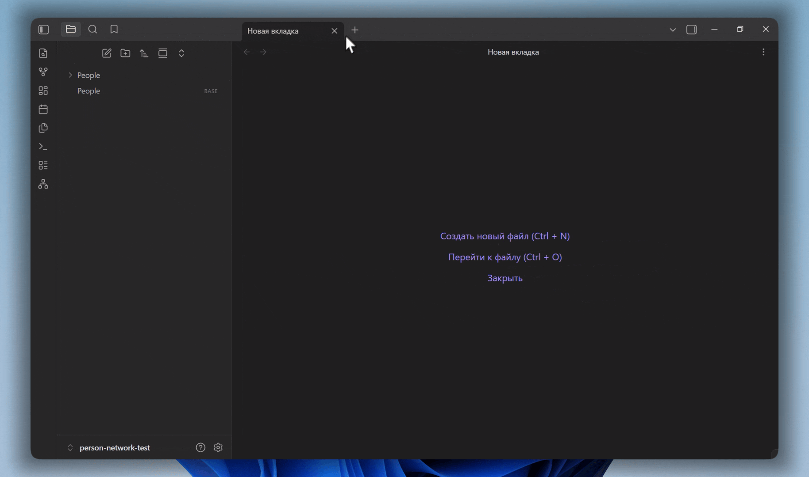
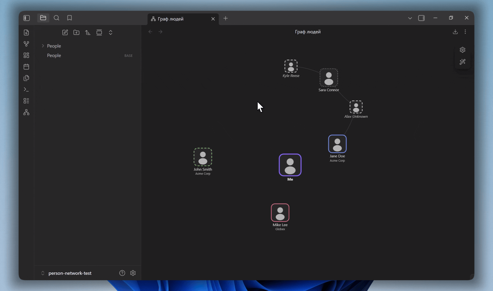
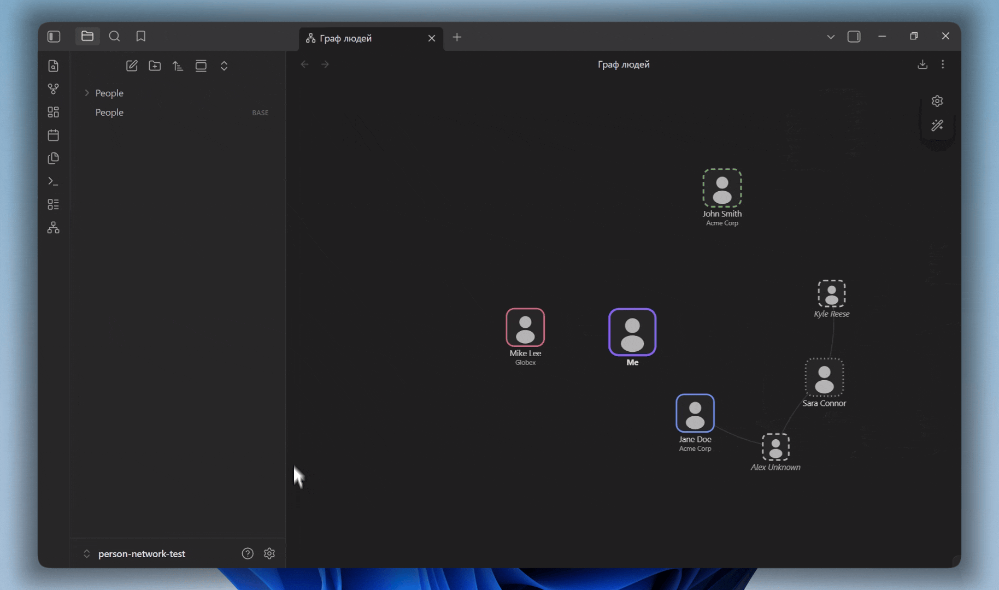
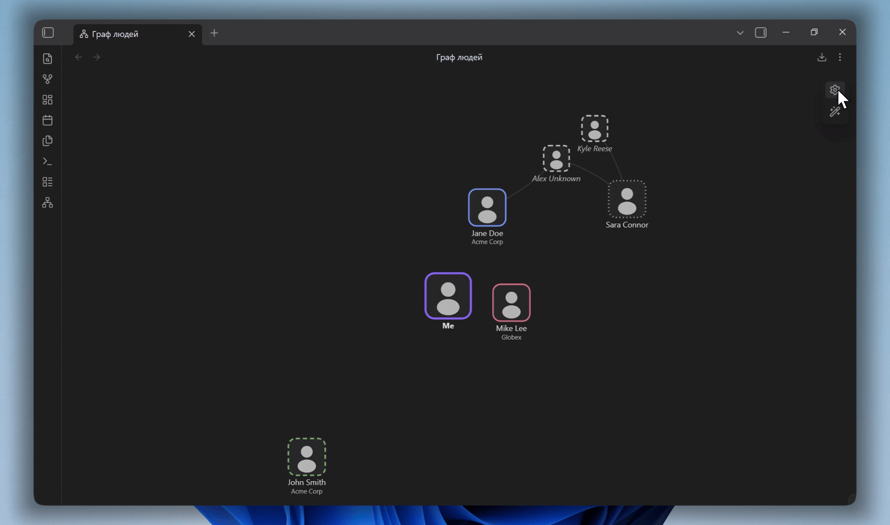
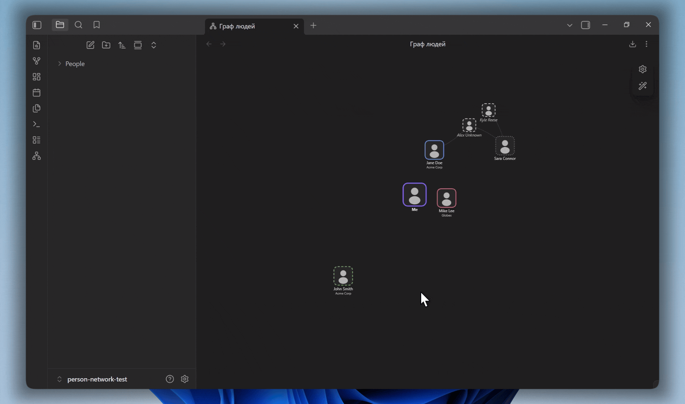

# Person Network

An Obsidian plugin that draws the people in your vault as an interactive, canvas-rendered relationship map. People are read from note frontmatter, positioned by a configurable role, connected by their listed contacts, and controlled through an in-graph panel modeled on Obsidian's own Graph view. The plugin can also run as a native view inside Bases.

Read this in another language: [Русский](README.ru.md)



## Features

- Canvas rendering with a dependency-free force simulation. The animation loop stops entirely once the layout settles, so an idle graph uses no CPU.
- People are detected by a single configurable tag. No separate index or data file is required; everything comes from note frontmatter.
- Roles map a relation value (for example friend, family, colleague) to a ring color, a ring stroke style (solid, dashed, dotted) and a position score from 1 to 10 that sets how close the person orbits the center.
- A center node represents you, taken from the note marked with `is_self`, or a generic placeholder when none is marked.
- Photos are drawn on nodes, decoded once and downscaled to save memory. A silhouette is shown when a photo is missing or fails to load.
- Potential contacts: names listed in a note that do not have their own note yet appear as distinct ghost nodes. Clicking a ghost offers to create its note.
- Relationship lines are drawn between people who reference each other by name.
- An in-graph control panel with search, filters by relation type and company, display options and force sliders, built to match the layout of Obsidian's core Graph view.
- Appearance animation: nodes fade and grow in from the center outward, then the connections fade in.
- Zoom to fit, smooth camera framing, pan, wheel zoom, node dragging and double-click to refit.
- Export the current view as a PNG image.
- Bases integration: the graph is available as a view type inside Bases, where the base's own filters decide who appears on the map.
- Light, dark and community themes are supported. All colors are read from Obsidian's CSS variables.
- Russian and English interface, detected automatically from Obsidian's language.

## Installation

### Manual

1. Download `main.js`, `manifest.json` and `styles.css` from the latest release.
2. Create a folder named `person-network` inside your vault at `.obsidian/plugins/`.
3. Place the three files in that folder.
4. Open Settings, go to Community plugins, and enable Person Network.

## Getting started

Create a note for a person and add frontmatter with the detection tag:

```yaml
---
tags:
  - person
name: Jane Doe
photo: attachments/jane.jpg
company: Acme Corp
relation: friend
potential_contacts:
  - John Smith
  - Kyle Reese
---
```

Open the graph from the ribbon icon or the command palette command "Open person network". The note tagged `person` becomes a node. To mark yourself as the center, add `is_self: true` to your own note.



## Frontmatter reference

| Field | Type | Description |
| --- | --- | --- |
| detection tag | tag | Marks a note as a person. Default tag is `person`, configurable in settings. |
| `name` | text | Display name. Falls back to the file name. |
| `photo` | text | Vault-relative path to a photo. |
| `relation` | text | The role name. Its ring style and position come from the Roles list. |
| `company` | text | Used by the company filter and shown under the node. |
| potential contacts | list | Names of contacts. A name with its own note becomes a connection; a name without one becomes a ghost node. |
| `is_self` | boolean | Marks the note as you. That node becomes the center. |

All field names except `is_self` and `company` are configurable in settings.

## Roles

A role ties together how a person looks and where they sit. Each role has a color, a ring stroke style and a position score from 1 to 10, where 10 is closest to the center. The `relation` value in a note selects its role. Any note whose relation does not match a defined role uses the default role.



## In-graph control panel

The panel opens from the gear icon in the top corner of the graph and mirrors the structure of the core Graph view.

- Filters: a search box that highlights and dims, plus toggles for each relation type and company.
- Display: toggles for connection lines and potential contacts, plus sliders for node size and line thickness.
- Forces: sliders for repel force, link force, link distance and center force.

A wand icon replays the appearance animation, and a reset icon restores the panel's controls to their defaults.



## Potential contacts

List a person's contacts in the contacts field. If a name matches another person note, a connection line is drawn between them. If a name has no note yet, it appears as a muted, dashed ghost node. Clicking a ghost opens a prompt to create its note, using the configured folder and template.

## Bases integration

When the Bases core plugin is enabled, Person Network registers a graph view type that can be selected inside any base. The base's filters decide which notes appear on the map, and per-view options in the Bases toolbar map the name, photo, relation and contacts properties. This can be turned off in settings.



## Settings

- Person detection: the recognition tag and the field names for name, photo, relation and contacts, plus paths to exclude.
- Roles: add, edit and remove roles, and set the default role.
- General: the center node label and the Bases integration toggle.
- New notes: the folder and template note used when creating a note from a ghost.