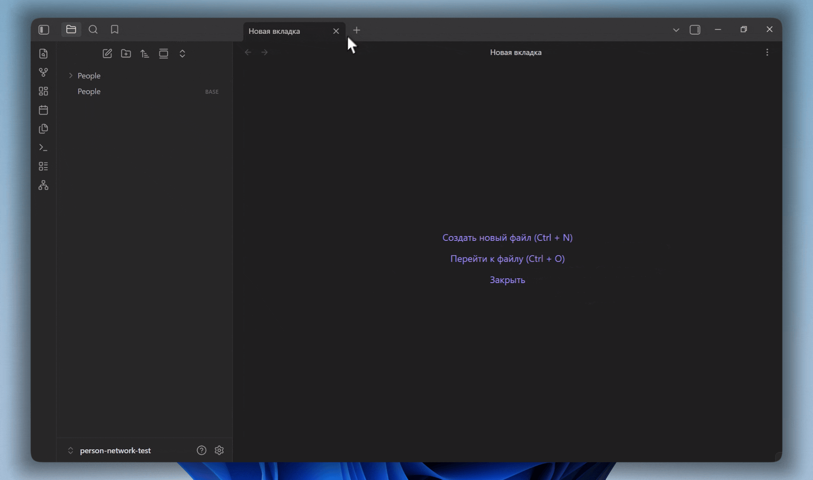
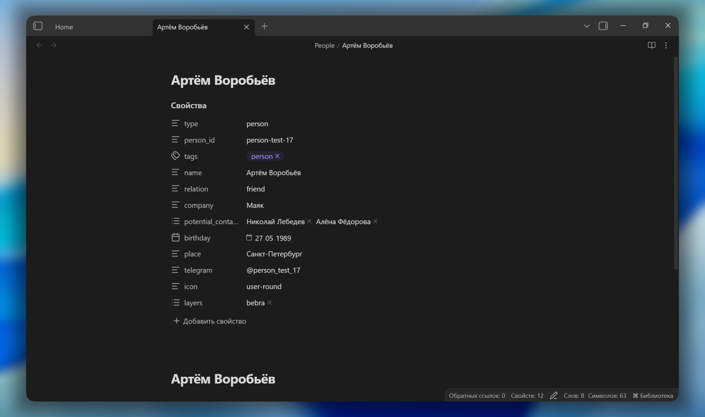
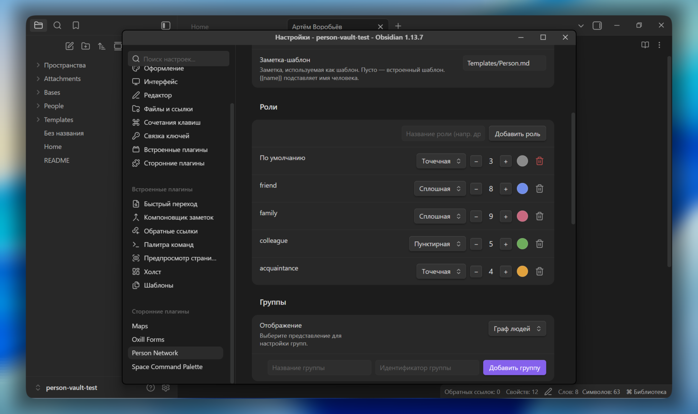
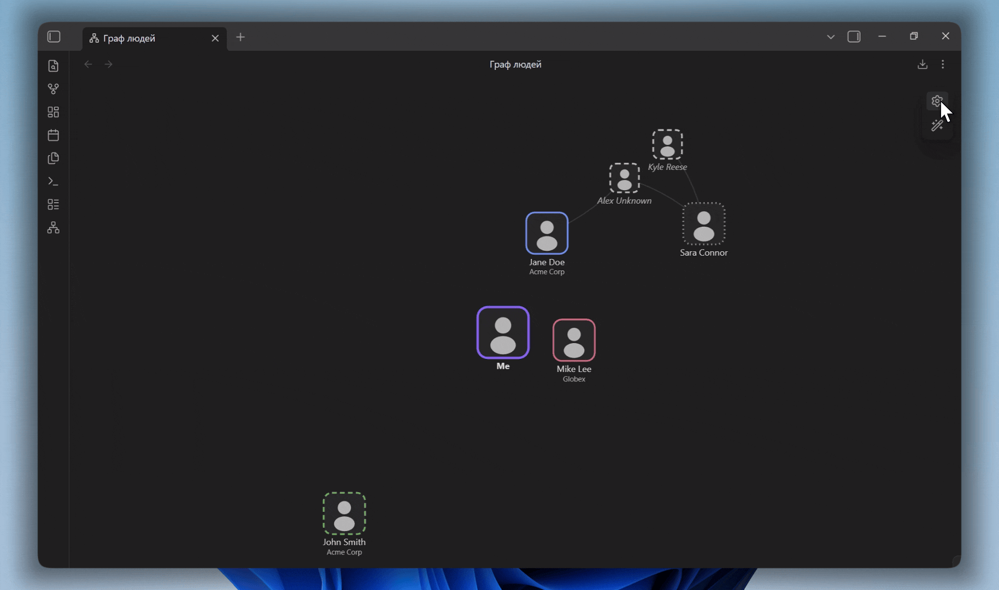
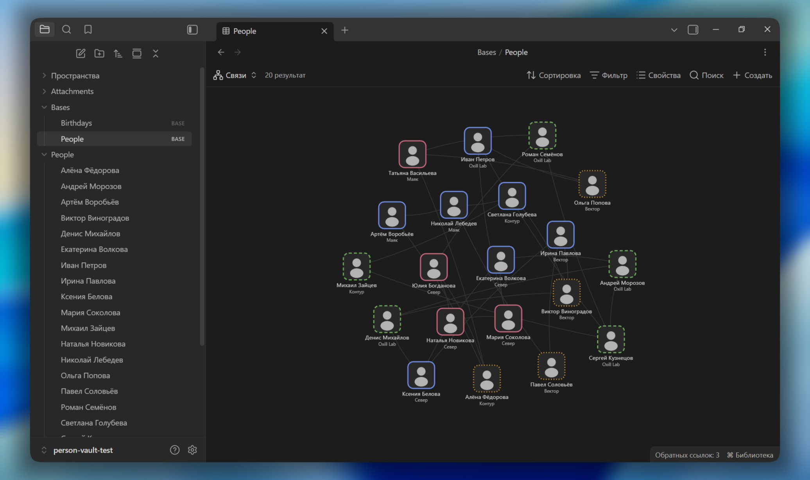

# Person Network

Person Network превращает заметки о людях в интерактивную карту связей Obsidian. Плагин работает локально, читает данные из frontmatter и может открываться как отдельный граф или как представление внутри Bases.



## Возможности

- Два способа отображения: вращающиеся орбиты и свободное пространство с кругами групп.
- Фотографии, имена, компании, роли, связи и потенциальные контакты.
- Выбор личной заметки в настройках без специального поля во frontmatter.
- Фильтрация по любым свойствам заметок с условиями «все» или «любое».
- Независимые наборы групп для обычного графа и каждого представления Bases.
- Плавное выделение связей человека или сотрудников одной компании при наведении.
- Неразрушающая настройка видимой области фотографии: исходный файл не изменяется.
- Автоматическое сохранение фильтров, масштаба, положения камеры и параметров отображения.
- Экспорт текущего графа в PNG.
- Русский и английский интерфейс в зависимости от языка Obsidian.

## Установка

Установите **Person Network** через **Настройки → Сторонние плагины → Обзор**.

Для ручной установки:

1. Скачайте `main.js`, `manifest.json` и `styles.css` из последнего релиза GitHub.
2. Создайте в хранилище папку `.obsidian/plugins/person-network/`.
3. Скопируйте в неё три файла.
4. Включите Person Network в разделе сторонних плагинов.

## Быстрый старт

Создайте отдельную заметку для каждого человека и добавьте frontmatter:

```yaml
---
tags:
  - person
name: Иван Петров
photo: attachments/ivan.jpg
company: Oxill Lab
relation: friend
potential_contacts:
  - Мария Соколова
  - "[[Люди/Алексей Орлов|Алексей Орлов]]"
layers:
  - family
  - work
---
```

Откройте граф кнопкой на ленте или командой **«Открыть граф людей»**. Затем выберите личную заметку в настройках плагина.



## Данные заметки

| Свойство | Тип | Назначение |
| --- | --- | --- |
| тег распознавания | тег | Добавляет заметку в граф. По умолчанию используется `person`. |
| `name` | текст | Имя на карточке. Если поле пустое, используется имя файла. |
| `photo` | текст | Путь к изображению внутри хранилища. |
| `relation` | текст | Роль человека из настроек плагина. |
| `company` | текст | Компания под именем человека. |
| `potential_contacts` | список | Имена или wikilinks связанных людей. |
| `layers` | список | Идентификаторы групп человека. |

Тег распознавания и названия полей `name`, `photo`, `relation`, `potential_contacts` и `layers` можно изменить в настройках. Поле `company` имеет фиксированное название.

## Способы отображения

### Орбита

Личная заметка находится в центре, а остальные люди располагаются на кольцах в соответствии с показателем роли от 1 до 10. Люди одной компании занимают соседние участки одной орбиты. Карточки равномерно вращаются вместе со своими связями; вращение можно отключить в панели **«Отображение»**.

Орбитальная модель использует фиксированную геометрию и не зависит от симуляции сил. Управление группами в этом режиме скрыто.

### Пространство

Личная заметка становится обычным участником графа. Включённые группы отображаются полупрозрачными кругами Эйлера: участник одной группы остаётся внутри её круга, общий участник располагается в пересечении, а человек без отображаемой группы — снаружи кругов.

Одновременно отображаются две группы с наибольшим приоритетом. Круг с одним видимым участником остаётся в списке, но не рисуется на графе.

## Роли

Роль определяет цвет и стиль обводки карточки. Для неё также задаётся показатель позиции от 1 до 10, который выбирает орбиту человека: чем выше значение, тем ближе карточка к центру.

Значение поля `relation` должно совпадать с названием роли. Для неизвестного значения применяется оформление по умолчанию, а плагин показывает предупреждение.



## Группы

Группы настраиваются в режиме **«Пространство»**. У каждой группы есть название, уникальный идентификатор, цвет и приоритет. Участники назначаются списком идентификаторов в общем поле frontmatter:

```yaml
layers:
  - family
  - project-alpha
```

Кнопка групп на графе открывает компактную панель. Кнопка с глазом скрывает круг, а кнопка с человеком — всех участников группы. Наборы групп независимы для обычного графа и каждого представления Bases; принадлежность людей всегда читается из общего поля frontmatter.

## Фильтры и отображение

Панель графа открывается кнопкой с шестерёнкой.

- **Фильтры** позволяют искать людей и создавать условия по любым свойствам frontmatter. Условия можно объединить по принципу «все» или «любое».
- **Отображение** переключает способ размещения, линии связей и потенциальные контакты, регулирует размер карточек и толщину линий. В режиме «Орбита» здесь также включается и отключается вращение.



При наведении на человека несвязанные карточки плавно тускнеют, а его связи остаются заметными. При наведении на название компании выделяются сотрудники этой компании. Если всплывающая карточка закрывает граф, удерживайте `Shift`.

Двойной щелчок по свободному месту вписывает граф в окно. Колесо мыши меняет масштаб, а перетаскивание свободного пространства перемещает камеру.

## Контакты

Плагин принимает в поле контактов обычные имена и wikilinks. Он учитывает пути и псевдонимы заметок. Найденный человек становится связью, а отсутствующий — потенциальным контактом.

Нажмите на потенциальный контакт, чтобы создать для него заметку. Папку и заметку-шаблон можно выбрать в настройках. В шаблоне поддерживается подстановка `{{name}}`.

## Фотографии

Нажмите правой кнопкой мыши по человеку и выберите **«Настроить обрезку фото»**. Перемещайте фотографию внутри квадрата и меняйте масштаб. Плагин сохраняет только параметры отображения в `data.json`, не изменяя и не копируя исходное изображение.

Редактор доступен и для личной заметки в центре орбитальной модели.

## Bases

При включённом встроенном плагине Bases выберите **Person Network** как вид базы. Фильтры Bases определяют набор заметок, а параметры вида сопоставляют свойства имени, фотографии, роли и контактов. У каждого представления Bases собственный набор групп и сохранённое состояние графа.

Интеграцию с Bases можно отключить в настройках Person Network. Для применения этого параметра требуется перезапуск плагина или Obsidian.



## Конфиденциальность

Person Network работает локально внутри хранилища. Плагин не выполняет сетевые запросы, не требует учётной записи, не показывает рекламу и не собирает телеметрию.
